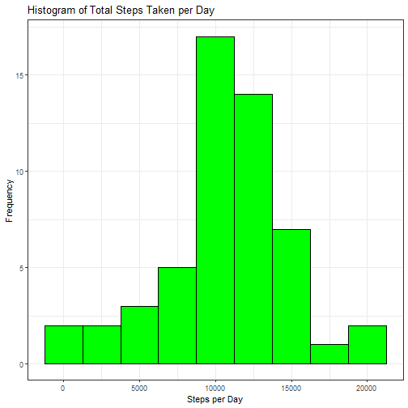
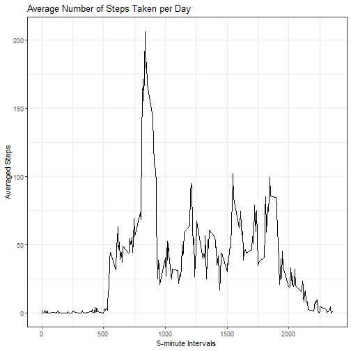
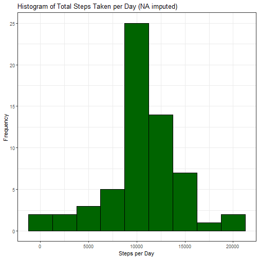
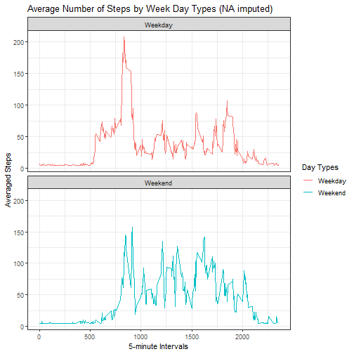

## R Markdown

This is an R Markdown document. Markdown is a simple formatting syntax for authoring HTML, PDF, and MS Word documents. For more details on using R Markdown see <http://rmarkdown.rstudio.com>.


```
## Loading required package: ggplot2
```

```
## Loading required package: data.table
```

```
## data.table 1.14.0 using 6 threads (see ?getDTthreads).  Latest news: r-datatable.com
```


## Loading and preprocessing the data


```r
if(!file.exists("./Week2/")) {unzip("./repdata_data_activity.zip", exdir = "./data_activity")}
if(!"activity" %in% ls()) {Activity <- read.csv("./data_activity/activity.csv")}

setDT(Activity)                                                 #Convert data.frame to data.table
Activity[, date := as.POSIXct(date, format = "%Y-%m-%d")]       #Format date
summary(Activity)
```

```
##      steps             date                        interval     
##  Min.   :  0.00   Min.   :2012-10-01 00:00:00   Min.   :   0.0  
##  1st Qu.:  0.00   1st Qu.:2012-10-16 00:00:00   1st Qu.: 588.8  
##  Median :  0.00   Median :2012-10-31 00:00:00   Median :1177.5  
##  Mean   : 37.38   Mean   :2012-10-30 23:32:27   Mean   :1177.5  
##  3rd Qu.: 12.00   3rd Qu.:2012-11-15 00:00:00   3rd Qu.:1766.2  
##  Max.   :806.00   Max.   :2012-11-30 00:00:00   Max.   :2355.0  
##  NA's   :2304
```

## What is mean total number of steps taken per day?

Summarize total number of steps taken per day

```r
Steps_Total <- Activity[, c(lapply(.SD, sum, na.rm = FALSE)), .SDcols = c("steps"), by = .(date)] 
summary(Steps_Total$steps)
```

```
##    Min. 1st Qu.  Median    Mean 3rd Qu.    Max.    NA's 
##      41    8841   10765   10766   13294   21194       8
```
1 Make a histogram of the total number of steps taken per day

```r
Plot1 <- ggplot(Steps_Total, aes(x = steps)) +
                geom_histogram(color="black", fill="green", binwidth = 2500) + 
                theme_bw() + 
                labs(x = "Steps per Day", y = "Frequency") +
                labs(title = "Histogram of Total Steps Taken per Day") 
        
print(Plot1)
```

```
## Warning: Removed 8 rows containing non-finite values (stat_bin).
```



2 Calculate and report the mean and median of the total number of steps taken per day

```r
Original <- Steps_Total[, .(Steps_Mean = mean(steps, na.rm = TRUE), Steps_Median = median(steps, na.rm = TRUE))]
Original
```

```
##    Steps_Mean Steps_Median
## 1:   10766.19        10765
```

## What is the average daily activity pattern?

1 Make a time series plot (i.e. type = "l") of the 5-minute interval (x-axis) and the average number of steps taken, averaged across all days (y-axis)

Calculate mean number of steps taken per interval

```r
Interval_Mean <- Activity[, c(lapply(.SD, mean, na.rm = TRUE)), .SDcols = c("steps"), by = .(interval)] 
```
Make a time series plot

```r
Plot2 <- ggplot(Interval_Mean, aes(interval, steps)) + 
                geom_line() + theme_bw()  +
                labs(x="5-minute Intervals", y="Averaged Steps") +
                labs(title = "Average Number of Steps Taken per Day") 

print(Plot2)
```



2 Which 5-minute interval, on average across all the days in the dataset, contains the maximum number of steps?

```r
Interval_Mean[steps == max(steps), .(max_interval = interval)]
```

```
##    max_interval
## 1:          835
```
- Maximum number of steps is reached at 835 interval


## Imputing missing values

1 Calculate and report the total number of missing values in the dataset (i.e. the total number of rows with NAs)

```r
nrow(Activity[is.na(steps),])
```

```
## [1] 2304
```
2 Devise a strategy for filling in all of the missing values in the dataset. The strategy does not need to be sophisticated. For example, you could use the mean/median for that day, or the mean for that 5-minute interval, etc.

3 Create a new dataset that is equal to the original dataset but with the missing data filled in.

```r
Activity1 <- Activity
```
Fill missing values (NAs) with mean of the steps. 

```r
Activity1[is.na(steps), "steps"] <- Activity1[, c(lapply(.SD, mean, na.rm = TRUE)), .SDcols = c("steps")]
```

```
## Warning in `[<-.data.table`(`*tmp*`, is.na(steps), "steps", value = structure(list(: 37.382600 (type 'double') at RHS position 1 truncated (precision
## lost) when assigning to type 'integer' (column 1 named 'steps')
```

4 Make a histogram of the total number of steps taken each day and calculate and report the mean and median total number of steps taken per day. Do these values differ from the estimates from the first part of the assignment? What is the impact of imputing missing data on the estimates of the total daily number of steps?


Summarize total number of steps taken per day (NA imputed)

```r
Steps_Total1 <- Activity1[, c(lapply(.SD, sum)), .SDcols = c("steps"), by = .(date)] 
```
Make a histogram of the total number of steps taken per day (NA imputed)

```r
Plot3 <- ggplot(Steps_Total1, aes(x = steps)) + 
                geom_histogram(color="black", fill="dark green", binwidth = 2500) + 
                theme_bw() + 
                labs(x = "Steps per Day", y = "Frequency") +
                labs(title = "Histogram of Total Steps Taken per Day (NA imputed)") 

print(Plot3)
```




Calculate and report the mean and median of the total number of steps taken per day (NA imputed)

```r
NA_Imputed <- Steps_Total1[, .(Steps_Mean = mean(steps), Steps_Median = median(steps))]
Original
```

```
##    Steps_Mean Steps_Median
## 1:   10766.19        10765
```

```r
NA_Imputed
```

```
##    Steps_Mean Steps_Median
## 1:   10751.74        10656
```
- For imputed NA the Steps mean is 10752 vs original steps mean 10766. Difference of 14 steps for mean.
- For imputed NA the Steps median is 10656 vs original steps median 10765. Difference of 109 steps for median.

## Are there differences in activity patterns between weekdays and weekends? 

For this part the weekdays() function applied. Used the dataset with the filled-in missing values for this part.

1 Create a new factor variable in the dataset with two levels -- "weekday" and "weekend" indicating whether a given date is a weekday or weekend day.

```r
Activity1[, `Day Types`:= weekdays(x = date)]
Activity1[grepl(pattern = "Monday|Tuesday|Wednesday|Thursday|Friday", x = `Day Types`), "Day Types"] <- "Weekday"
Activity1[grepl(pattern = "Saturday|Sunday", x = `Day Types`), "Day Types"] <- "Weekend"
Activity1[, `Day Types` := as.factor(`Day Types`)]
summary(Activity1)
```

```
##      steps             date                        interval        Day Types    
##  Min.   :  0.00   Min.   :2012-10-01 00:00:00   Min.   :   0.0   Weekday:12960  
##  1st Qu.:  0.00   1st Qu.:2012-10-16 00:00:00   1st Qu.: 588.8   Weekend: 4608  
##  Median :  0.00   Median :2012-10-31 00:00:00   Median :1177.5                  
##  Mean   : 37.33   Mean   :2012-10-30 23:32:27   Mean   :1177.5                  
##  3rd Qu.: 37.00   3rd Qu.:2012-11-15 00:00:00   3rd Qu.:1766.2                  
##  Max.   :806.00   Max.   :2012-11-30 00:00:00   Max.   :2355.0
```
2 Make a panel plot containing a time series plot (i.e. type = "l") of the 5-minute interval (x-axis) and the average number of steps taken, averaged across all weekday days or weekend days (y-axis).

```r
Interval_Mean1 <- Activity1[, c(lapply(.SD, mean, na.rm = TRUE)), .SDcols = c("steps"), by = .(interval,`Day Types`)] 

Plot4 <- ggplot(Interval_Mean1 , aes(x = interval , y = steps, color=`Day Types`)) +
                geom_line() + theme_bw() +
                facet_wrap(~`Day Types` , ncol = 1, nrow=2) +
                labs(x="5-minute Intervals", y="Averaged Steps") +
                labs(title = "Average Number of Steps by Week Day Types (NA imputed)") 
               

print(Plot4)
```



- There are observed differences in activity patterns between weekdays and weekends 
